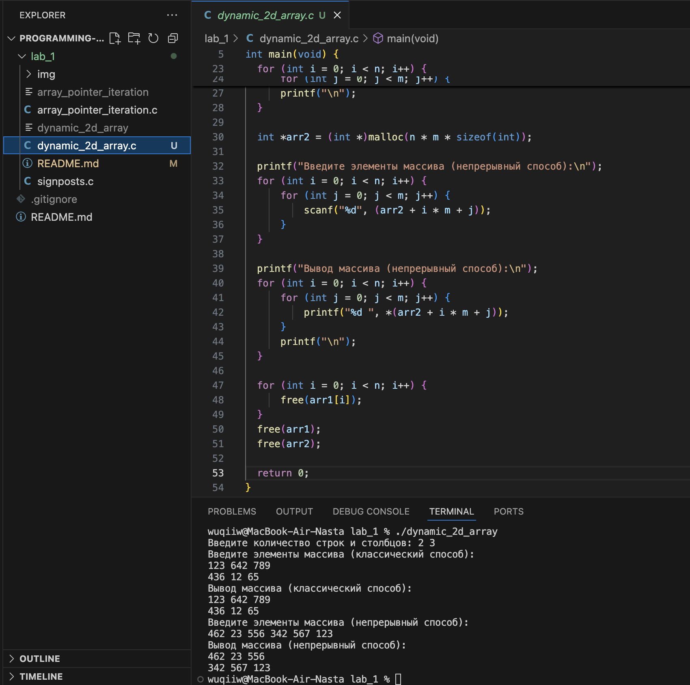

# Тема: Указатели  
## Задача 1 – упражнения с malloc и сложными однострочными выражениями в C с присваиваниями внутри  

### Постановка задачи  
Внутри функции int main(void) { /*...*/ } определите указатель:
double ***pointer = NULL;
Инициализируйте этот указатель адресом другого указателя типа double **, который указывает, в свою очередь, на
переменную double. Используйте pointer для записи и чтения в эту переменную значения 2.
При этом выполните следующее: - Используйте функции типа *alloc(...) для выделения оперативной памяти под
динамические объекты; - Запишите и выведите число 2 на экран, используя указатель double ***pointer = NULL;;
- Используйте функцию free(...) для освобождения оперативной памяти, выделенной под динамические объекты.
- Не используйте никаких идентификаторов переменных, кроме pointer.

---

### Математическая модель  
- Трёхуровневая система указателей:  
  - `pointer` → `double**` → `double*` → `double`.  
- В памяти хранится значение `2.0`.  
- Доступ к переменной и её модификация выполняется исключительно через `pointer`.  

---

### Список идентификаторов  

| Имя переменной | Тип данных  | Описание |
|----------------|-------------|----------|
| pointer        | double***   | Указатель на указатель на указатель на double |

### Код программы  

```c
#include <stdio.h>
#include <stdlib.h>

int main(void) {
    double ***pointer = NULL;

    pointer = (double ***)malloc(sizeof(double **));
    *pointer = (double **)malloc(sizeof(double *));
    **pointer = (double *)malloc(sizeof(double));

    ***pointer = 2.0;

    printf("Значение: %.1f\n", ***pointer);

    free(**pointer);
    free(*pointer);
    free(pointer);

    return 0;
}
```

### Результаты работы программы   

---

## Задача 2 - итерация массива с помощью арифметики указателей

### Постановка задачи
Напишите программу, которая создает одномерный динамический массив из чисел с плавающей точкой двойной точности, заполняет его значениями с клавиатуры и выводит все элементы массива, используя арифметику указателей
(оператор +), а не оператор доступа к элементам массива [].

### Математическая модель  
- Создаётся одномерный динамический массив элементов типа `double`.  
- Доступ к элементам массива осуществляется через арифметику указателей:  
  - `(arr + i)` — адрес элемента,  
  - `*(arr + i)` — значение элемента.  
- Таким образом, обход массива происходит без использования синтаксиса `arr[i]`.  

### Список идентификаторов  

| Имя переменной | Тип данных | Описание |
|----------------|------------|----------|
| arr            | double*    | Указатель на первый элемент динамического массива |
| n              | int        | Количество элементов массива |
| i              | int        | Счётчик цикла |

### Код программы  

```c
#include <stdio.h>
#include <stdlib.h>

int main(void) {
    int n;
    printf("Введите количество элементов массива: ");
    scanf("%d", &n);

    double *arr = (double *)malloc(n * sizeof(double));
    if (arr == NULL) {
        printf("Ошибка выделения памяти!\n");
        return 1;
    }

    printf("Введите %d элементов массива:\n", n);
    for (int i = 0; i < n; i++) {
        scanf("%lf", (arr + i));
    }

    printf("Элементы массива:\n");
    for (int i = 0; i < n; i++) {
        printf("%.2f ", *(arr + i));
    }
    printf("\n");

    free(arr);

    return 0;
}
```

### Результаты работы программы

---

## Задача 3 - динамический 2D массив

### Постановка задачи 
Выделите память под двумерный динамический массив двумя способами:
1. Классический способ: выделите память для массива указателей на строки и отдельно для каждой строки в
цикле. Это позволит гибко управлять памятью, но при этом каждая строка будет находиться в отдельной части
памяти.
2. Непрерывный способ (contiguous memory allocation): выделите память для всего массива одним вызовом
malloc, что позволит разместить весь массив в непрерывном блоке памяти, улучшая производительность и
снижая риск внешней фрагментации памяти.
После выполнения программы обязательно корректно освободите всю выделенную оперативную память с помощью
free().
Оба метода имеют свои преимущества и недостатки. При непрерывном выделении (contiguous allocation) вся память
выделяется в одном блоке, что уменьшает вероятность фрагментации, но может усложнить управление при необходимости изменения размеров массива.

### Математическая модель  
- Массив имеет форму `n x m`.  
- В классическом подходе создаётся массив указателей на строки (`int**`), каждая строка выделяется отдельно.  
- В непрерывном подходе создаётся один блок памяти размером `n*m`, а доступ к элементу осуществляется по формуле: arr[i][j] ↔ *(arr + i * m + j)

### Список идентификаторов  
| Имя переменной | Тип данных | Описание |
|----------------|------------|----------|
| n              | int        | Количество строк |
| m              | int        | Количество столбцов |
| arr1           | int**      | Двумерный массив (классический способ) |
| arr2           | int*       | Двумерный массив (непрерывный способ) |
| i, j           | int        | Счётчики циклов |


### Код программы  

```c
#include <stdio.h>
#include <stdlib.h>

int main(void) {
  int n, m;
  printf("Введите количество строк и столбцов: ");
  scanf("%d %d", &n, &m);

  int **arr1 = (int **)malloc(n * sizeof(int *));
  for (int i = 0; i < n; i++) {
      arr1[i] = (int *)malloc(m * sizeof(int));
  }

  printf("Введите элементы массива (классический способ):\n");
  for (int i = 0; i < n; i++) {
      for (int j = 0; j < m; j++) {
          scanf("%d", &arr1[i][j]);
      }
  }

  printf("Вывод массива (классический способ):\n");
  for (int i = 0; i < n; i++) {
      for (int j = 0; j < m; j++) {
          printf("%d ", arr1[i][j]);
      }
      printf("\n");
  }

  int *arr2 = (int *)malloc(n * m * sizeof(int));

  printf("Введите элементы массива (непрерывный способ):\n");
  for (int i = 0; i < n; i++) {
      for (int j = 0; j < m; j++) {
          scanf("%d", (arr2 + i * m + j));
      }
  }

  printf("Вывод массива (непрерывный способ):\n");
  for (int i = 0; i < n; i++) {
      for (int j = 0; j < m; j++) {
          printf("%d ", *(arr2 + i * m + j));
      }
      printf("\n");
  }

  for (int i = 0; i < n; i++) {
      free(arr1[i]);
  }
  free(arr1);
  free(arr2);

  return 0;
}
```

### Результаты работы программы

---

### Информация о студенте  
Полторацкая Анастасия, 1 курс, группа `1об_ПОО/25`
