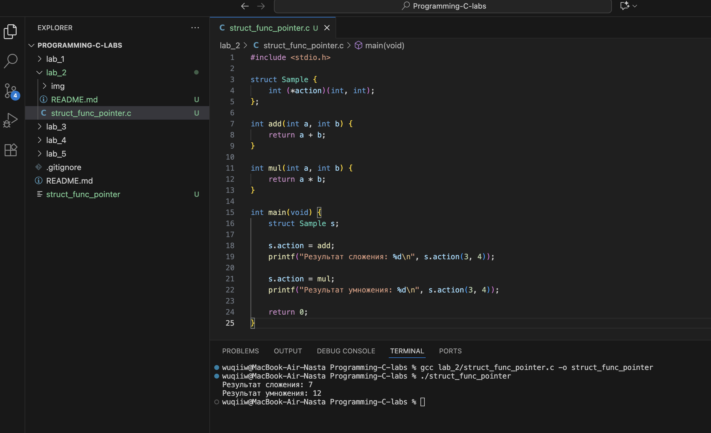
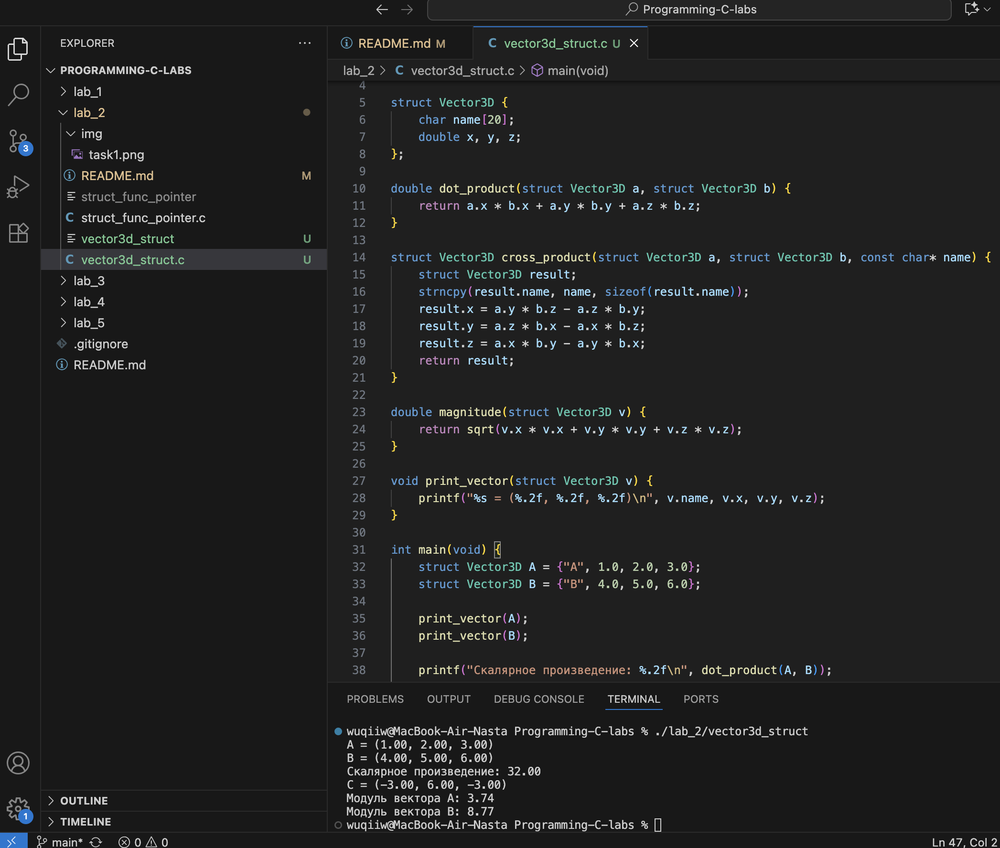

# Тема: Структуры
## Задача 1 - создать структуру с указателем на функцию

### Постановка задачи
Создайте структуру, одно из полей которой является указателем на функцию. Вызовите эту функцию через имя переменной структуры и поле указателя на функцию.

### Математическая модель
- В языке C указатель на функцию позволяет хранить адрес функции и вызывать её через этот указатель.  
- Структура может содержать такой указатель как поле.  
- Это позволяет гибко менять поведение программы, назначая разные функции одной и той же структуре.  

### Список идентификаторов  

| Имя переменной | Тип данных        | Описание |
|----------------|-------------------|----------|
| action         | int (*)(int, int) | Указатель на функцию, принимающую два `int` и возвращающую `int` |
| s              | struct Sample     | Экземпляр структуры с указателем на функцию |
| add            | функция           | Складывает два числа |
| mul            | функция           | Умножает два числа |

### Код программы  
```c
#include <stdio.h>

struct Sample {
    int (*action)(int, int);  
};

int add(int a, int b) {
    return a + b;
}

int mul(int a, int b) {
    return a * b;
}

int main(void) {
    struct Sample s;

    s.action = add;
    printf("Результат сложения: %d\n", s.action(3, 4));

    s.action = mul;
    printf("Результат умножения: %d\n", s.action(3, 4));

    return 0;
}
```
### Результаты работы программы
 
---

## Задача 2 - структура для вектора в трёхмерном пространстве

### Постановка задачи
Реализуйте структуру для вектора в 3D пространстве и добавьте следующие функции:
• Скалярное умножение векторов;
• Векторное произведение;
• Модуль вектора;
• Распечатка вектора.
В структуре также должно быть поле для хранения имени вектора.

### Математическая модель
Пусть векторы заданы как:  
```
A = (x1, y1, z1)  
B = (x2, y2, z2)
```  

1. Скалярное произведение: 
```
A · B = x1·x2 + y1·y2 + z1·z2
```  

2. Векторное произведение: 
```
A × B = (y1·z2 – z1·y2, z1·x2 – x1·z2, x1·y2 – y1·x2)
```  

3. Модуль вектора: 
```
|A| = √(x1² + y1² + z1²)
```  

### Список идентификаторов  

| Имя переменной | Тип данных       | Описание |
|----------------|------------------|----------|
| name           | char[]           | Имя вектора |
| x, y, z        | double           | Координаты вектора |
| dot_product    | функция          | Скалярное произведение |
| cross_product  | функция          | Векторное произведение |
| magnitude      | функция          | Модуль вектора |
| print_vector   | функция          | Печать вектора |

### Код программы  

```c
#include <stdio.h>
#include <math.h>
#include <string.h>

struct Vector3D {
    char name[20];
    double x, y, z;
};

double dot_product(struct Vector3D a, struct Vector3D b) {
    return a.x * b.x + a.y * b.y + a.z * b.z;
}

struct Vector3D cross_product(struct Vector3D a, struct Vector3D b, const char* name) {
    struct Vector3D result;
    strncpy(result.name, name, sizeof(result.name));
    result.x = a.y * b.z - a.z * b.y;
    result.y = a.z * b.x - a.x * b.z;
    result.z = a.x * b.y - a.y * b.x;
    return result;
}

double magnitude(struct Vector3D v) {
    return sqrt(v.x * v.x + v.y * v.y + v.z * v.z);
}

void print_vector(struct Vector3D v) {
    printf("%s = (%.2f, %.2f, %.2f)\n", v.name, v.x, v.y, v.z);
}

int main(void) {
    struct Vector3D A = {"A", 1.0, 2.0, 3.0};
    struct Vector3D B = {"B", 4.0, 5.0, 6.0};

    print_vector(A);
    print_vector(B);

    printf("Скалярное произведение: %.2f\n", dot_product(A, B));

    struct Vector3D C = cross_product(A, B, "C");
    print_vector(C);

    printf("Модуль вектора %s: %.2f\n", A.name, magnitude(A));
    printf("Модуль вектора %s: %.2f\n", B.name, magnitude(B));

    return 0;
}
```

### Результаты работы программы  
 
---

### Информация о студенте  
Полторацкая Анастасия, 1 курс, группа `1об_ПОО/25`
