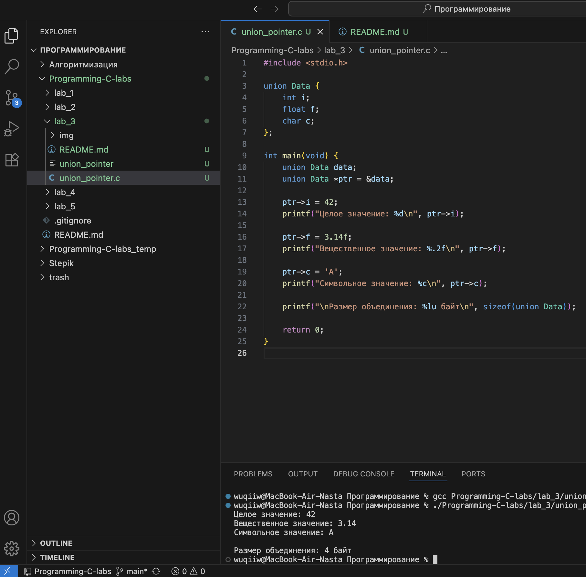
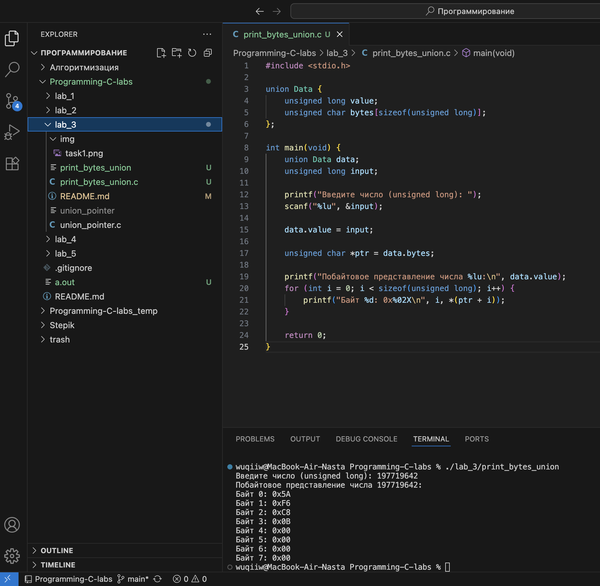

# Тема: Объединения и перечисления  
## Задача 1 – указатель на объединение  

### Постановка задачи  
Написать программу, которая использует указатель на некоторое объединение (union).  
Создать и проинициализировать переменные в объединении через указатель, затем вывести их значения на экран.  

### Математическая модель  
**Объединение (union)** позволяет хранить разные типы данных в одной и той же области памяти.  
В каждый момент времени активно только одно поле объединения.  
Обращение к данным происходит через указатель, который указывает на экземпляр объединения.  

### Список идентификаторов  

| Имя переменной | Тип данных | Описание |
|----------------|------------|----------|
| data           | union      | Объединение, содержащее разные типы данных |
| i              | int        | Целое значение |
| f              | float      | Число с плавающей точкой |
| c              | char       | Символ |
| ptr            | указатель  | Указатель на объединение |
| print_union    | функция    | Вывод текущего значения объединения |

### Код программы  

```c
#include <stdio.h>

union Data {
    int i;
    float f;
    char c;
};

int main(void) {
    union Data data;        
    union Data *ptr = &data; 

    ptr->i = 42;
    printf("Целое значение: %d\n", ptr->i);

    ptr->f = 3.14f;
    printf("Вещественное значение: %.2f\n", ptr->f);

    ptr->c = 'A';
    printf("Символьное значение: %c\n", ptr->c);

    printf("\nРазмер объединения: %lu байт\n", sizeof(union Data));

    return 0;
}
```

### Результаты работы программы  

--- 

## Задача 2 – побайтовая распечатка числа  

### Постановка задачи  
Написать программу, которая использует объединение (`union`) для побайтовой распечатки значения переменной типа `unsigned long`.  
Каждый байт должен быть выведен отдельно через указатель на `char`.  

### Математическая модель  
Объединение позволяет интерпретировать одну и ту же область памяти по-разному.  
Если объединить `unsigned long` и массив `unsigned char`, можно считывать байты числа напрямую.  

### Список идентификаторов  

| Имя переменной | Тип данных            | Описание |
|----------------|-----------------------|----------|
| value          | unsigned long         | Исходное число |
| bytes          | unsigned char[]       | Байтовое представление числа |
| data           | union                 | Объединение для хранения числа и его байтов |
| i              | int                   | Индекс для обхода байтов |
| ptr            | unsigned char*        | Указатель на байты числа |

### Код программы  

```c
#include <stdio.h>

union Data {
    unsigned long value;
    unsigned char bytes[sizeof(unsigned long)];
};

int main(void) {
    union Data data;
    unsigned long input;

    printf("Введите число (unsigned long): ");
    scanf("%lu", &input);

    data.value = input;

    unsigned char *ptr = data.bytes;

    printf("Побайтовое представление числа %lu:\n", data.value);
    for (int i = 0; i < sizeof(unsigned long); i++) {
        printf("Байт %d: 0x%02X\n", i, *(ptr + i));
    }

    return 0;
}
```

### Результаты работы программы  

---

### Информация о студенте  
Полторацкая Анастасия, 1 курс, группа `1об_ПОО/25`
