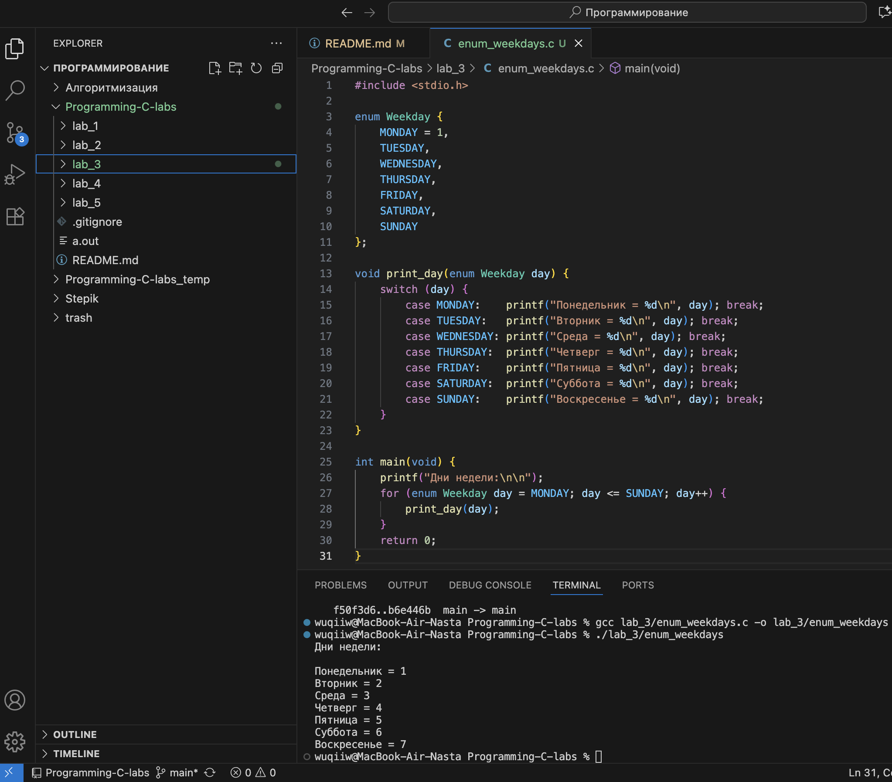
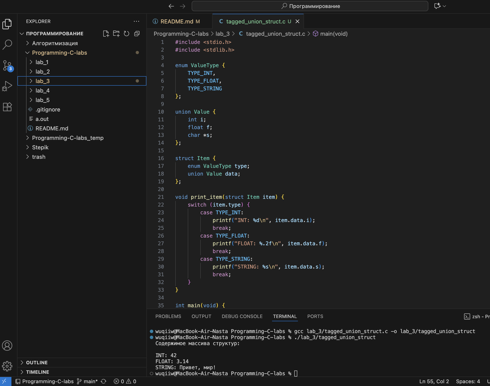

# Тема: Объединения и перечисления  
## Задача 1 – указатель на объединение  

### Постановка задачи  
Написать программу, которая использует указатель на некоторое объединение (union).  
Создать и проинициализировать переменные в объединении через указатель, затем вывести их значения на экран.  

### Математическая модель  
**Объединение (union)** позволяет хранить разные типы данных в одной и той же области памяти.  
В каждый момент времени активно только одно поле объединения.  
Обращение к данным происходит через указатель, который указывает на экземпляр объединения.  

### Список идентификаторов  

| Имя переменной | Тип данных | Описание |
|----------------|------------|----------|
| data           | union      | Объединение, содержащее разные типы данных |
| i              | int        | Целое значение |
| f              | float      | Число с плавающей точкой |
| c              | char       | Символ |
| ptr            | указатель  | Указатель на объединение |
| print_union    | функция    | Вывод текущего значения объединения |

### Код программы  

```c
#include <stdio.h>

union Data {
    int i;
    float f;
    char c;
};

int main(void) {
    union Data data;        
    union Data *ptr = &data; 

    ptr->i = 42;
    printf("Целое значение: %d\n", ptr->i);

    ptr->f = 3.14f;
    printf("Вещественное значение: %.2f\n", ptr->f);

    ptr->c = 'A';
    printf("Символьное значение: %c\n", ptr->c);

    printf("\nРазмер объединения: %lu байт\n", sizeof(union Data));

    return 0;
}
```

### Результаты работы программы  

--- 

## Задача 2 – побайтовая распечатка числа  

### Постановка задачи  
Написать программу, которая использует объединение (`union`) для побайтовой распечатки значения переменной типа `unsigned long`.  
Каждый байт должен быть выведен отдельно через указатель на `char`.  

### Математическая модель  
Объединение позволяет интерпретировать одну и ту же область памяти по-разному.  
Если объединить `unsigned long` и массив `unsigned char`, можно считывать байты числа напрямую.  

### Список идентификаторов  

| Имя переменной | Тип данных            | Описание |
|----------------|-----------------------|----------|
| value          | unsigned long         | Исходное число |
| bytes          | unsigned char[]       | Байтовое представление числа |
| data           | union                 | Объединение для хранения числа и его байтов |
| i              | int                   | Индекс для обхода байтов |
| ptr            | unsigned char*        | Указатель на байты числа |

### Код программы  

```c
#include <stdio.h>

union Data {
    unsigned long value;
    unsigned char bytes[sizeof(unsigned long)];
};

int main(void) {
    union Data data;
    unsigned long input;

    printf("Введите число (unsigned long): ");
    scanf("%lu", &input);

    data.value = input;

    unsigned char *ptr = data.bytes;

    printf("Побайтовое представление числа %lu:\n", data.value);
    for (int i = 0; i < sizeof(unsigned long); i++) {
        printf("Байт %d: 0x%02X\n", i, *(ptr + i));
    }

    return 0;
}
```

### Результаты работы программы  

---

## Задача 3 – перечисление дней недели  

### Постановка задачи  
Создать перечислимый тип данных (enum) для семи дней недели.  
Реализовать программу, которая выводит на экран значения каждого дня недели как целое число.  

### Математическая модель  
**Перечисления (enum)** используются для задания набора именованных констант.  
Каждому элементу присваивается целое значение, начиная с 0 (по умолчанию) или с заданного числа.  

### Список идентификаторов  

| Имя переменной | Тип данных | Описание |
|----------------|------------|----------|
| Weekday        | enum       | Перечисление для дней недели |
| day            | enum Weekday | Текущий день в цикле |
| print_day      | функция    | Печать дня недели и его значения |

### Код программы  

```c
#include <stdio.h>

enum Weekday {
    MONDAY = 1,
    TUESDAY,
    WEDNESDAY,
    THURSDAY,
    FRIDAY,
    SATURDAY,
    SUNDAY
};

void print_day(enum Weekday day) {
    switch (day) {
        case MONDAY:    printf("Понедельник = %d\n", day); break;
        case TUESDAY:   printf("Вторник = %d\n", day); break;
        case WEDNESDAY: printf("Среда = %d\n", day); break;
        case THURSDAY:  printf("Четверг = %d\n", day); break;
        case FRIDAY:    printf("Пятница = %d\n", day); break;
        case SATURDAY:  printf("Суббота = %d\n", day); break;
        case SUNDAY:    printf("Воскресенье = %d\n", day); break;
    }
}

int main(void) {
    printf("Дни недели:\n\n");
    for (enum Weekday day = MONDAY; day <= SUNDAY; day++) {
        print_day(day);
    }
    return 0;
}
```
### Результаты работы программы 

---

## Задача 4 – размеченное объединение  

### Постановка задачи  
Создать размеченное объединение (union), заключённое в структуру,  
которая также содержит перечисление (enum) — индикатор того,  
какой тип данных в данный момент хранится в объединении.  
Создать динамический массив таких структур и реализовать функцию для вывода их содержимого на экран.  

### Математическая модель  
- Используется структура, которая содержит:
  - поле `type` — значение перечисления (enum), определяющее активный тип данных;
  - объединение `Value`, содержащее возможные типы (`int`, `float`, `char*`).  
- В каждый момент времени активно только одно поле объединения.  
- Для вывода используется `switch(type)`, который выбирает, как интерпретировать значение.  

### Список идентификаторов  

| Имя переменной | Тип данных | Описание |
|----------------|------------|----------|
| ValueType      | enum       | Перечисление типов данных |
| Value          | union      | Объединение с различными типами |
| Item           | struct     | Структура с полем `type` и `data` |
| items          | Item*      | Динамический массив структур |
| print_item     | функция    | Вывод содержимого одной структуры |
| n              | int        | Количество элементов массива |

### Код программы  

```c
#include <stdio.h>
#include <stdlib.h>

enum ValueType {
    TYPE_INT,
    TYPE_FLOAT,
    TYPE_STRING
};

union Value {
    int i;
    float f;
    char *s;
};

struct Item {
    enum ValueType type;
    union Value data;
};

void print_item(struct Item item) {
    switch (item.type) {
        case TYPE_INT:
            printf("INT: %d\n", item.data.i);
            break;
        case TYPE_FLOAT:
            printf("FLOAT: %.2f\n", item.data.f);
            break;
        case TYPE_STRING:
            printf("STRING: %s\n", item.data.s);
            break;
    }
}

int main(void) {
    int n = 3;
    struct Item *items = malloc(n * sizeof(struct Item));

    items[0].type = TYPE_INT;
    items[0].data.i = 42;

    items[1].type = TYPE_FLOAT;
    items[1].data.f = 3.14f;

    items[2].type = TYPE_STRING;
    items[2].data.s = "Привет, мир!";

    printf("Содержимое массива структур:\n\n");
    for (int i = 0; i < n; i++) {
        print_item(items[i]);
    }

    free(items);
    return 0;
}
```

### Результаты работы программы  

---

### Информация о студенте  
Полторацкая Анастасия, 1 курс, группа `1об_ПОО/25`
