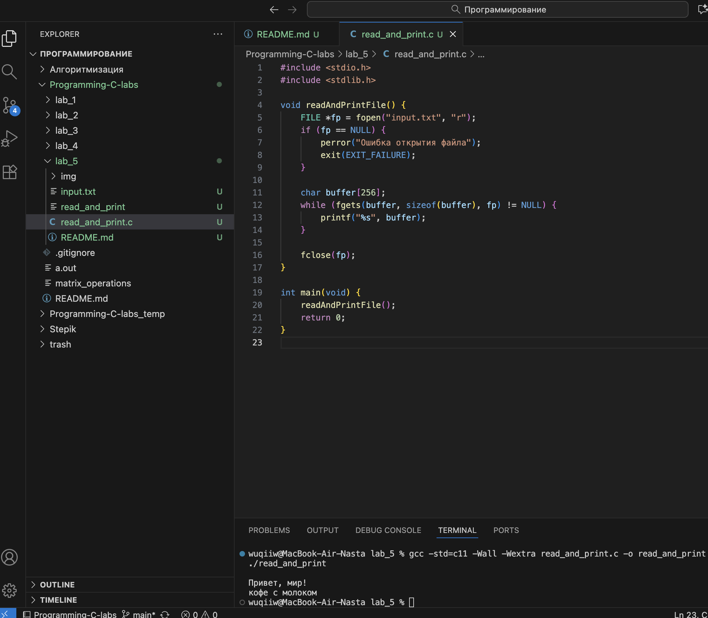

# Тема: Файловый ввод-вывод
## Задача 1 - Чтение и вывод содержимого текстового файла

### Постановка задачи
Напишите программу, которая открывает текстовый файл (например, “input.txt”) для чтения, считывает его построчно с помощью функции fgets() и выводит каждую строку на стандартный вывод. Программа должна проверять,
успешно ли открыт файл, и корректно закрывать его после чтения.

### Математическая модель
- Файл открывается в режиме чтения (`r`).  
- С помощью функции `fgets()` строки считываются из файла до конца.  
- При каждой итерации строка выводится на экран.  
- После завершения чтения файл закрывается функцией `fclose()`.  
- Если открыть файл не удалось — программа завершается с сообщением об ошибке. 

### Список идентификаторов  

| Имя переменной | Тип данных | Описание |
|----------------|-------------|----------|
| `fp` | `FILE*` | Указатель на открытый файл |
| `buffer` | `char[256]` | Буфер для хранения считанной строки |

### Код программы  

```c
#include <stdio.h>
#include <stdlib.h>

void readAndPrintFile() {
    FILE *fp = fopen("input.txt", "r");
    if (fp == NULL) {
        perror("Ошибка открытия файла");
        exit(EXIT_FAILURE);
    }

    char buffer[256];
    while (fgets(buffer, sizeof(buffer), fp) != NULL) {
        printf("%s", buffer);
    }

    fclose(fp);
}

int main(void) {
    readAndPrintFile();
    return 0;
}
```

### Результаты работы программы
 
---
### Информация о студенте  
Полторацкая Анастасия, 1 курс, группа `1об_ПОО/25`