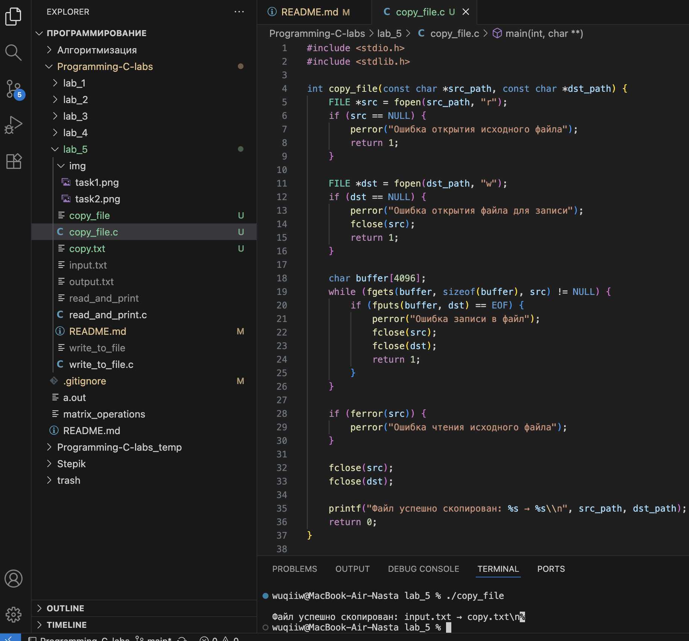
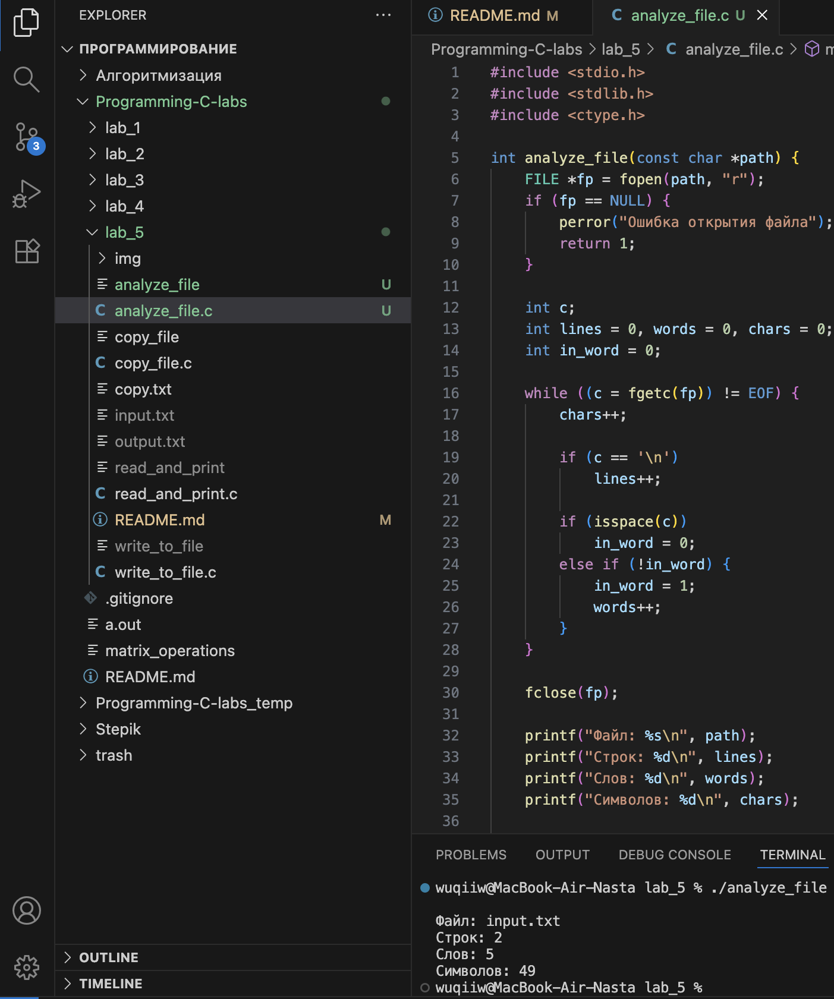

# Тема: Файловый ввод-вывод
## Задача 1 - Чтение и вывод содержимого текстового файла

### Постановка задачи
Напишите программу, которая открывает текстовый файл (например, “input.txt”) для чтения, считывает его построчно с помощью функции fgets() и выводит каждую строку на стандартный вывод. Программа должна проверять,
успешно ли открыт файл, и корректно закрывать его после чтения.

### Математическая модель
- Файл открывается в режиме чтения (`r`).  
- С помощью функции `fgets()` строки считываются из файла до конца.  
- При каждой итерации строка выводится на экран.  
- После завершения чтения файл закрывается функцией `fclose()`.  
- Если открыть файл не удалось — программа завершается с сообщением об ошибке. 

### Список идентификаторов  

| Имя переменной | Тип данных | Описание |
|----------------|-------------|----------|
| `fp` | `FILE*` | Указатель на открытый файл |
| `buffer` | `char[256]` | Буфер для хранения считанной строки |

### Код программы  

```c
#include <stdio.h>
#include <stdlib.h>

void readAndPrintFile() {
    FILE *fp = fopen("input.txt", "r");
    if (fp == NULL) {
        perror("Ошибка открытия файла");
        exit(EXIT_FAILURE);
    }

    char buffer[256];
    while (fgets(buffer, sizeof(buffer), fp) != NULL) {
        printf("%s", buffer);
    }

    fclose(fp);
}

int main(void) {
    readAndPrintFile();
    return 0;
}
```

### Результаты работы программы
 
---

## Задача 2 - запись данных в текстовый файл 

### Постановка задачи
Написать программу, которая создаёт текстовый файл и записывает в него несколько строк.  
Имя файла можно передать через аргумент командной строки, иначе по умолчанию используется `output.txt`.  
Каждая строка записывается с помощью функции `fputs()`.  
После завершения программа должна закрывать файл и выводить сообщение об успешной записи.

### Математическая модель
Для данной задачи математическая модель **не требуется**,  
так как она связана с процедурной работой с файлами —  
операциями **открытия, записи и закрытия**.

### Список идентификаторов  

| Имя переменной | Тип данных     | Описание |
|----------------|----------------|----------|
| `path`         | `const char*`  | Имя файла для записи |
| `fp`           | `FILE*`        | Указатель на открытый файл |
| `lines`        | `const char*[]`| Массив строк для записи |
| `i`            | `int`          | Индекс строки при итерации |
| `argc`         | `int`          | Количество аргументов командной строки |
| `argv`         | `char**`       | Аргументы командной строки |

### Код программы  

```c
#include <stdio.h>
#include <stdlib.h>

int write_file(const char *path) {
    FILE *fp = fopen(path, "w");
    if (fp == NULL) {
        perror("Ошибка открытия файла для записи");
        return 1;
    }

    const char *lines[] = {
        "Первая строка в файле.",
        "Вторая строка: пример записи.",
        "Третья строка — завершение записи.",
        NULL
    };

    for (int i = 0; lines[i] != NULL; i++) {
        if (fputs(lines[i], fp) == EOF || fputc('\n', fp) == EOF) {
            perror("Ошибка при записи в файл");
            fclose(fp);
            return 1;
        }
    }

    if (fclose(fp) == EOF) {
        perror("Ошибка закрытия файла");
        return 1;
    }

    printf("Данные успешно записаны в файл: %s\n", path);
    return 0;
}

int main(int argc, char **argv) {
    const char *path = (argc > 1) ? argv[1] : "output.txt";
    int rc = write_file(path);
    return rc ? EXIT_FAILURE : EXIT_SUCCESS;
}
```

### Результаты работы программы  

---

## Задача 3 — копирование содержимого одного файла в другой

### Постановка задачи
Напишите программу, которая копирует содержимое файла “source.txt” в новый файл “destination.txt”. Программа
должна открывать исходный файл в режиме чтения, а целевой — в режиме записи. Содержимое копируется блоками
(например, по 256 байт) с использованием функций fread() и fwrite()

### Математическая модель
Задача не требует математической модели.  
Программа выполняет последовательность операций ввода и вывода:
1. Открытие файла для чтения;  
2. Открытие другого файла для записи;  
3. Чтение построчно с помощью `fgets()` и запись строк через `fputs()`;  
4. Закрытие обоих файлов.

### Список идентификаторов  

| Имя переменной | Тип данных     | Описание |
|----------------|----------------|-----------|
| `src_path`     | `const char*`  | Имя исходного файла |
| `dst_path`     | `const char*`  | Имя файла-копии |
| `src`          | `FILE*`        | Указатель на исходный файл |
| `dst`          | `FILE*`        | Указатель на выходной файл |
| `buffer`       | `char[]`       | Буфер для чтения строк |
| `argc`         | `int`          | Количество аргументов командной строки |
| `argv`         | `char**`       | Аргументы командной строки |

### Код программы  

```c
#include <stdio.h>
#include <stdlib.h>

int copy_file(const char *src_path, const char *dst_path) {
    FILE *src = fopen(src_path, "r");
    if (src == NULL) {
        perror("Ошибка открытия исходного файла");
        return 1;
    }

    FILE *dst = fopen(dst_path, "w");
    if (dst == NULL) {
        perror("Ошибка открытия файла для записи");
        fclose(src);
        return 1;
    }

    char buffer[4096];
    while (fgets(buffer, sizeof(buffer), src) != NULL) {
        if (fputs(buffer, dst) == EOF) {
            perror("Ошибка записи в файл");
            fclose(src);
            fclose(dst);
            return 1;
        }
    }

    if (ferror(src)) {
        perror("Ошибка чтения исходного файла");
    }

    fclose(src);
    fclose(dst);

    printf("Файл успешно скопирован: %s → %s\\n", src_path, dst_path);
    return 0;
}

int main(int argc, char **argv) {
    const char *src_path = (argc > 1) ? argv[1] : "input.txt";
    const char *dst_path = (argc > 2) ? argv[2] : "copy.txt";

    int rc = copy_file(src_path, dst_path);
    return rc ? EXIT_FAILURE : EXIT_SUCCESS;
}
```

### Результаты работы программы  

---

## Задача 4 — подсчёт количества строк, слов и символов в текстовом файле

### Постановка задачи
Написать программу, которая открывает текстовый файл (`input.txt`)  
и подсчитывает количество:
- строк,
- слов,
- символов (включая пробелы и знаки препинания).

Результаты вывести на экран.  
Имя файла можно передать аргументом командной строки;  
если не указано — используется `input.txt` по умолчанию.

### Математическая модель
Пусть файл содержит последовательность символов, разделённых пробельными символами и переводами строк.  
Тогда:
- количество **символов** — общее количество считанных знаков;
- количество **строк** — количество встреченных символов `'\n'` + 1, если файл не пуст;
- количество **слов** — количество последовательностей символов, разделённых пробелами, табуляцией или переводом строки.

### Список идентификаторов  

| Имя переменной | Тип данных | Описание |
|----------------|-------------|----------|
| `path`         | `const char*` | Имя файла для анализа |
| `fp`           | `FILE*`       | Указатель на открытый файл |
| `c`            | `int`         | Считываемый символ |
| `lines`        | `int`         | Счётчик строк |
| `words`        | `int`         | Счётчик слов |
| `chars`        | `int`         | Счётчик символов |
| `in_word`      | `int`         | Флаг, показывает, находимся ли внутри слова |

### Код программы  

```c
#include <stdio.h>
#include <stdlib.h>
#include <ctype.h>

int analyze_file(const char *path) {
    FILE *fp = fopen(path, "r");
    if (fp == NULL) {
        perror("Ошибка открытия файла");
        return 1;
    }

    int c;
    int lines = 0, words = 0, chars = 0;
    int in_word = 0;

    while ((c = fgetc(fp)) != EOF) {
        chars++;

        if (c == '\n')
            lines++;

        if (isspace(c))
            in_word = 0;
        else if (!in_word) {
            in_word = 1;
            words++;
        }
    }

    fclose(fp);

    printf("Файл: %s\n", path);
    printf("Строк: %d\n", lines);
    printf("Слов: %d\n", words);
    printf("Символов: %d\n", chars);

    return 0;
}

int main(int argc, char **argv) {
    const char *path = (argc > 1) ? argv[1] : "input.txt";
    int rc = analyze_file(path);
    return rc ? EXIT_FAILURE : EXIT_SUCCESS;
}
```

### Результаты работы программы  

---

### Информация о студенте  
Полторацкая Анастасия, 1 курс, группа `1об_ПОО/25`