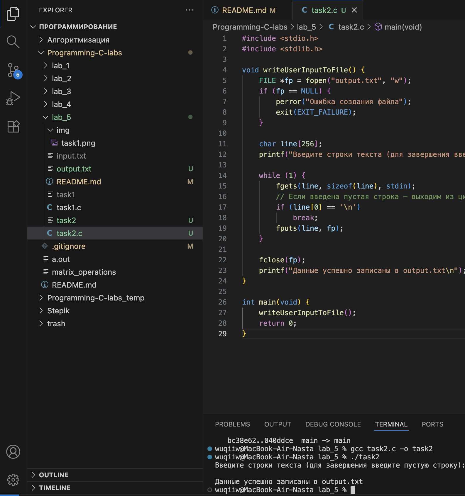

# Тема: Файловый ввод-вывод
## Задача 1 - Чтение и вывод содержимого текстового файла

### Постановка задачи
Напишите программу, которая открывает текстовый файл (например, “input.txt”) для чтения, считывает его построчно с помощью функции fgets() и выводит каждую строку на стандартный вывод. Программа должна проверять,
успешно ли открыт файл, и корректно закрывать его после чтения.

### Список идентификаторов

| Имя переменной | Тип данных | Описание |
|----------------|-------------|-----------|
| `fp` | `FILE*` | Указатель на открытый файл |
| `buffer` | `char[256]` | Буфер для хранения считанной строки |
| `readAndPrintFile()` | `void` | Функция для открытия, чтения и вывода содержимого файла |
| `main()` | `int` | Главная функция программы |

### Код программы

```c
#include <stdio.h>
#include <stdlib.h>

void readAndPrintFile() {
    FILE *fp = fopen("input.txt", "r");
    if (fp == NULL) {
        perror("Ошибка открытия файла");
        exit(EXIT_FAILURE);
    }

    char buffer[256];
    while (fgets(buffer, sizeof(buffer), fp) != NULL) {
        printf("%s", buffer);
    }

    fclose(fp);
}

int main(void) {
    readAndPrintFile();
    return 0;
}
```

### Результаты работы программы  

--- 

## Задача 2. Запись пользовательского ввода в текстовый файл

### Постановка задачи
Создайте программу, которая запрашивает у пользователя несколько строк текста, а затем записывает введённые данные в файл “output.txt”. Используйте режим записи "w". После завершения записи файл закрывается, а программа
выводит сообщение об успешном завершении.

### Список идентификаторов

| Имя переменной | Тип данных | Описание |
|----------------|-------------|-----------|
| `fp` | `FILE*` | Указатель на открытый файл |
| `line` | `char[256]` | Буфер для хранения введённой строки |
| `writeUserInputToFile()` | `void` | Функция, выполняющая запись пользовательского ввода в файл |
| `main()` | `int` | Главная функция программы |

### Код программы

```c
#include <stdio.h>
#include <stdlib.h>

void writeUserInputToFile() {
    FILE *fp = fopen("output.txt", "w");
    if (fp == NULL) {
        perror("Ошибка создания файла");
        exit(EXIT_FAILURE);
    }

    char line[256];
    printf("Введите строки текста (для завершения введите пустую строку):\n");

    while (1) {
        fgets(line, sizeof(line), stdin);
        // Если введена пустая строка — выходим из цикла
        if (line[0] == '\n')
            break;
        fputs(line, fp);
    }

    fclose(fp);
    printf("Данные успешно записаны в output.txt\n");
}

int main(void) {
    writeUserInputToFile();
    return 0;
}
```

### Результаты работы программы  

---
### Информация о студенте  
Полторацкая Анастасия, 1 курс, группа `1об_ПОО/25`